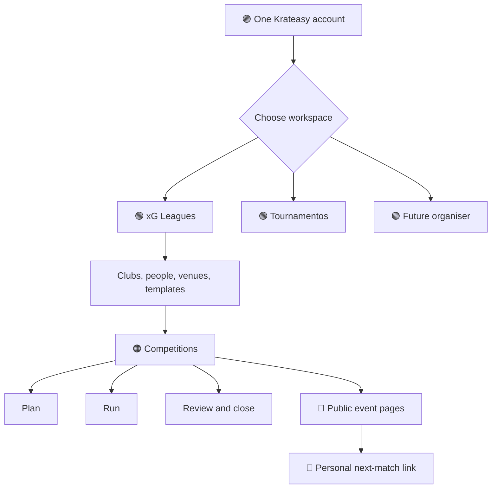
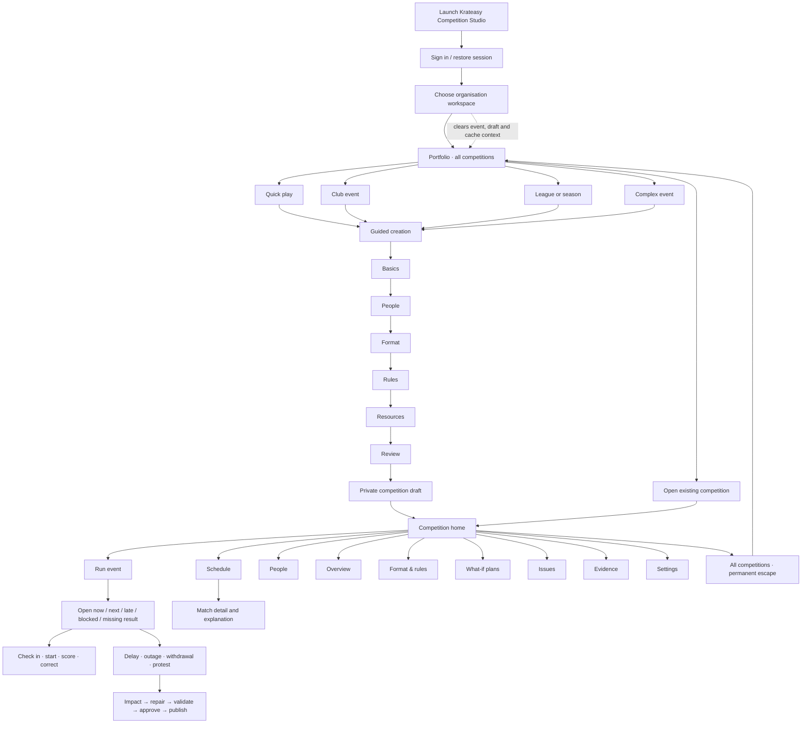
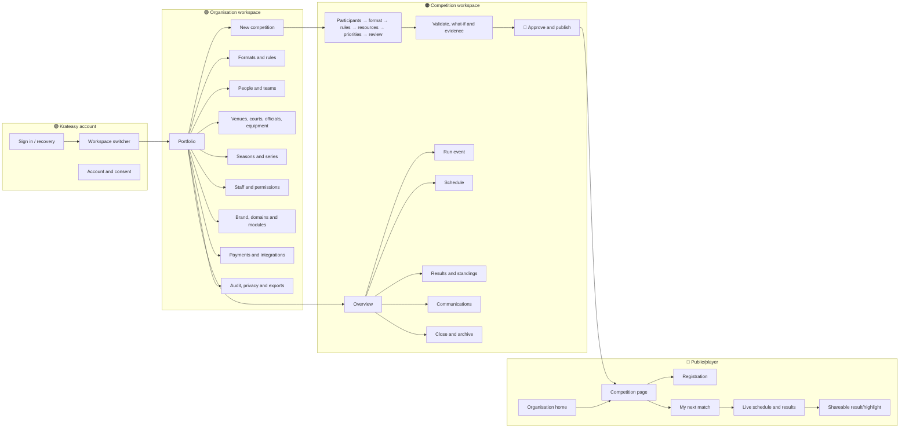
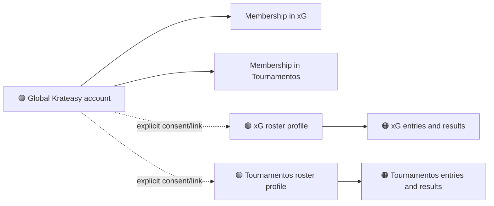

# Krateasy Competitions: application and universe field guide

## Decision in one sentence

Krateasy should operate one shared competition platform with many strongly isolated **organisation workspaces**; each workspace has a public home for players and a private home for staff, while every competition is compiled by the same deterministic engine.

In product copy, use **organisation** during setup and **workspace** in daily navigation. Keep **universe** as the architecture and white-label concept, not another noun ordinary organisers must learn.

## Colour key

- 🟣 **Krateasy account layer** — identity, account recovery and the workspace switcher.
- 🟢 **Organisation workspace** — data and configuration owned by one organisation.
- 🟠 **Competition** — one tournament, league, cup, class or activity and its revisions.
- 🔵 **Public/player surface** — install-free pages and personal links.
- 🔴 **Controlled action** — approval, publication, payment, data export or other sensitive boundary.

Colour is always paired with a label or shape in the product; it is never the only way to understand state.

## The simplest mental model



There are only three homes a person needs to understand:

1. **Portfolio** — organisers choose or create a competition.
2. **Event workspace** — staff plan or run one competition.
3. **My match** — a participant sees what they need next.

The compiler, proofs, integrations and tenant controls sit behind those homes. They should not become the primary navigation.

## Public and private addresses

| Purpose | Canonical pattern | Example |
|---|---|---|
| Public organisation home | `https://{workspace}.krateasy.com` | `https://xgleagues.krateasy.com` |
| Public competition | `https://{workspace}.krateasy.com/c/{competition}` | `https://xgleagues.krateasy.com/c/summer-padel-2026` |
| Personal event view | `https://{workspace}.krateasy.com/p/{opaque-token}` | Not guessable and never contains a player name |
| Private workspace | `https://app.krateasy.com/u/{workspace}` | `https://app.krateasy.com/u/xgleagues` |
| Private competition | `https://app.krateasy.com/u/{workspace}/competitions/{id}` | Stable even if the public slug changes |
| Custom public domain | Organisation-owned domain mapped to the same public projection | `https://play.xgleagues.com` |

The Krateasy public subdomain remains the recovery address when a custom domain is disconnected. One domain is marked canonical; the other redirects to it. Private administration stays on `app.krateasy.com` initially so authentication, support and anti-phishing controls remain consistent.

## Who uses which surface

The platform is broader than a club-owner product, but that does not mean every person should be pushed into the professional Mac app.

| Person and job | Primary surface | Simplest entry | When they need Studio |
|---|---|---|---|
| Friends running a quick competition | Krateasy mobile or responsive web | **Quick play** | Rarely; only for advanced scheduling |
| Participant, parent or spectator | Install-free public/personal page; Krateasy mobile when already installed | Event or personal link | Never |
| Coach or academy lead | Krateasy owner panel or responsive web | **Club event** | Multi-division rules, scarce resources or repair |
| Facility owner | Krateasy owner panel | Template-led competition | Advanced design, evidence or live recovery |
| Independent organiser or promoter | Competition Studio on web/Mac/iPad | **Club event** or **Complex event** | Primary operating surface |
| League or circuit operator | Competition Studio | **League or season** | Primary operating surface |
| Federation or governing body | Studio plus governed platform APIs | Certified template/rule pack | Primary approval and audit surface |
| Desk operator, official or referee | Focused mobile/iPad operational view | Assignment or match deep link | Only if granted broader responsibility |
| Auditor or support specialist | Read-only evidence workbench | Signed revision link | When formal evidence is required |
| White-label platform customer | Public custom domain plus central private Studio | Its own workspace URL | Primary administration surface |
| Integration partner | Versioned API/webhooks | Explicit organisation grant | Never through visual administration by default |

The no-drift rule is: **one authoritative competition platform, several job-specific shells**. Ordinary Krateasy users should not install a second app, and the professional Studio should not be diluted into a consumer social product.

## Exact Mac Studio screen flow



### What is visible on every Mac screen

```text
Krateasy Competitions
├── Workspace switcher: Play & Konnect ▾
├── Context: Play & Konnect › Autumn Open › Schedule
├── Permanent actions: All competitions · New competition · Refresh
└── Current role and connection state
```

### Desktop sidebar

```text
Organisation workspace ▾

WORKSPACE
  All competitions
  New competition

CURRENT COMPETITION
  Competition picker ▾

OPERATE
  Home
  Run event
  Schedule
  People

DESIGN & VERIFY
  Overview
  Format & rules
  What-if plans
  Evidence

  Settings
```

The compiler graph, proof hashes and raw rule provenance remain reachable, but normal operators encounter them through plain-language **Issues**, **Why this schedule?** and **Evidence** views rather than as the application home.

## App map



### Navigation rules that prevent the “locked demo” feeling

- The workspace switcher, **All competitions** and **New competition** are always reachable.
- Opening a competition changes context but never removes the route back to the portfolio.
- The header always states `Workspace › Competition › Area`.
- Demo data is visibly labelled and can be exited or reset.
- Advanced tools are grouped under **Design & verify** and appear when relevant; the compiler is not a top-level destination for normal operators.
- Mobile navigation has no more than five primary destinations: **Home, Run, Schedule, People, More**.
- Desktop uses the same information architecture in a sidebar; it does not invent a second product.

## Production-critical journey catalogue

“All journeys” here means every journey that creates, changes, publishes, operates, consumes or removes authoritative competition data. Cosmetic settings pages can hang from the same map without changing its safety model.

### J1 — New organiser creates a workspace

`Sign up → Create organisation → Claim public slug → Choose default sport/timezone → Create first competition`

- **Aha:** a useful draft exists before branding, billing or integrations are requested.
- **Friction to avoid:** asking for a club, venue, season and staff hierarchy before the first event can be drafted.
- **Guardrail:** slug availability is not authority; the immutable organisation ID is the security boundary.

### J2 — Invited staff member joins

`Invite link → Sign in or create account → See requested organisation and role → Accept → Land in its portfolio`

- **Aha:** the intended event and next job are visible immediately.
- **Friction to avoid:** accepting an invite into the wrong currently selected workspace.
- **Guardrail:** invite is single-use, expiring, organisation-bound and cannot grant more scope than its issuer possesses.

### J3 — Multi-workspace organiser switches context

`Workspace switcher → Choose organisation → Portfolio refreshes → Open competition`

- **Aha:** branding and data change together, with the new workspace name permanently visible.
- **Friction to avoid:** “sticky” filters, cached data or open dialogs crossing the boundary.
- **Guardrail:** switching clears organisation-scoped caches, optimistic drafts and background subscriptions.

### J4 — Create and publish a competition

`Portfolio → New competition → Participants → Format → Rules → Resources → Priorities → Review → Compile → Resolve findings → Separate approval → Publish`

- **Aha:** the review explains why the schedule is valid, not merely that one was generated.
- **Friction to avoid:** exposing graph primitives before the organiser has expressed their real-world intent.
- **Guardrail:** publication binds one approved definition revision, effective policy pack, graph, schedule and proof certificate.

### J5 — Duplicate or reuse a successful format

`Completed competition → Save as template → Create version → Approve version → Set workspace/club default → Use in new competition`

- **Aha:** the next event starts with proven decisions without copying stale participants or dates.
- **Friction to avoid:** silently changing existing events when a template is edited.
- **Guardrail:** events pin an immutable template version; template upgrades are explicit migrations.

### J6 — Participant discovers and registers

`Public organisation link → Browse competition → Registration → Payment/waiver if required → Confirmation → Personal link`

- **Aha:** registration and the personal event link work in an ordinary browser.
- **Friction to avoid:** app install, account creation or notification permission before the core answer is visible.
- **Guardrail:** public registration writes through a narrow organisation- and competition-scoped API with abuse controls.

### J7 — Participant asks “when do I play?”

`SMS/WhatsApp/email/QR → Opaque personal link → Next effective time + arrival target + sponsored court name + opponent/dependency → Optional alert opt-in`

- **Aha:** the answer appears in under ten seconds.
- **Friction to avoid:** forcing the player to scan a full schedule or search again after every round.
- **Guardrail:** token can reveal only the minimum participant projection and can be revoked or rotated.

### J8 — Staff run the event

`Event → Run → Now / next / late / blocked / result needed → Open item → Perform one contextual action → Confirm`

- **Aha:** the control room tells the operator what needs attention rather than showing an undifferentiated dashboard.
- **Friction to avoid:** requiring operators to understand format graphs to record a score or start a match.
- **Guardrail:** every command is idempotent, authorised and appended to the event ledger.

### J9 — Live disruption and schedule repair

`Report delay/outage/withdrawal → Show affected matches and players → Generate minimum-disruption repair → Independent validation → Different approver confirms → Publish delta → Notify only affected people`

- **Aha:** unaffected matches stay put and every move has a reason.
- **Friction to avoid:** a magic “fix it” button that changes the schedule before impact is understood.
- **Guardrail:** operational fact, proposal, approval and public update are distinct durable states.

### J10 — Result correction, protest or appeal

`Find match → View score history → Submit correction/protest → Supply reason/evidence → Authorised decision → Recompute affected progression → Approve and publish consequences`

- **Aha:** the original result remains visible in the audit trail.
- **Friction to avoid:** using a destructive edit that makes downstream bracket changes mysterious.
- **Guardrail:** append-only revisions, authority evidence and explicit downstream invalidation.

### J11 — Player follows and shares the outcome

`Personal/public page → Live result → Standings/bracket → Share card → Persistent competition history`

- **Aha:** the share card is instantly useful but links back to authoritative live results.
- **Friction to avoid:** generating social graphics that become false after a correction.
- **Guardrail:** every graphic displays the publication revision or live freshness state.

### J12 — Organisation connects a custom domain

`Brand & domains → Enter domain → Receive DNS challenge → Verify ownership → Provision TLS → Preview → Make canonical`

- **Aha:** the public experience looks independent while the private workspace remains familiar.
- **Friction to avoid:** a domain cutover that breaks existing links.
- **Guardrail:** verified ownership, reserved-slug checks, certificate health, canonical redirects and automatic fallback to the Krateasy subdomain.

### J13 — Owner manages roles, privacy and integrations

`Workspace settings → Staff / privacy / integrations → Review scope and effect → Step-up authentication → Apply → Audit entry`

- **Aha:** the owner can see exactly which clubs and competitions a role can reach.
- **Friction to avoid:** one vague “admin” role with invisible superpowers.
- **Guardrail:** least privilege, last-owner protection, separate credentials per organisation, secret references rather than secret values.

### J14 — Support and break-glass recovery

`Support request → Verify owner → Time-boxed support grant → Reason recorded → Read-only by default → Explicit elevated action if approved → Automatic expiry`

- **Aha:** the customer can see what support accessed.
- **Friction to avoid:** a global super-admin silently browsing every organisation.
- **Guardrail:** break-glass access is rare, time-limited, separately audited and never uses a customer’s session.

### J15 — Close, export or leave

`Complete competition → Final proof → Export → Archive → Optional organisation export/deletion → Detach custom domain`

- **Aha:** history remains coherent and portable.
- **Friction to avoid:** deleting identity records that are required to explain an authoritative sporting result.
- **Guardrail:** personal data can be anonymised while immutable competition facts retain non-identifying referential integrity.

## Organisation isolation contract

The organisation is already a first-class aggregate in the reference platform, and production startup requires a tenant-scoped transactional store with forced row-level security. The proposed white-label “universe” is not fully delivered yet: the current organisation model has ID, name, slug and status, but does not yet model branding, domains, module entitlements, payment accounts, integration credentials or a production public read projection.

The next implementation must satisfy all of these boundaries:

1. **Immutable authority:** every organisation gets an opaque immutable ID. Slugs and domains are routing aliases and may change.
2. **Request resolution:** host/path resolves to one organisation ID before any business query. Authenticated membership must name the same ID.
3. **Database:** every tenant-owned row, event stream, command, snapshot and outbox record carries the organisation ID; forced RLS is tested with a non-owner database role.
4. **Application:** repositories require organisation context instead of accepting it optionally. Cross-organisation object references fail closed even if IDs exist.
5. **Caches and files:** cache keys, CDN keys, object-storage paths, exports and temporary files are organisation-prefixed and never share unscoped indexes.
6. **Queues and webhooks:** payload, signing key, idempotency key and delivery lease bind the organisation. Replay into another organisation is rejected.
7. **Search and analytics:** search documents and analytics events carry organisation scope; support dashboards use aggregate, privacy-safe views.
8. **Secrets and payments:** provider credentials and payment accounts are referenced per organisation. A public request can never select them using client-supplied IDs.
9. **Public projection:** public pages read a deliberately minimal, publication-derived model; they do not query the organiser aggregate directly.
10. **Testing:** every authorised happy path is paired with the same request using another organisation’s IDs, host, token, cache key and webhook signature.

### Identity must be split cleanly



A person may use one Krateasy account across organisations, but a workspace roster, local rating, notes, eligibility and payment history remain organisation-owned. Cross-workspace portability is an explicit consented link, not an accidental shared player row.

## Friction audit

| Risk | Why it hurts | Required correction | Priority |
|---|---|---|---|
| “Universe” shown as a new user-facing noun | Adds architecture jargon | Say organisation during setup, workspace in navigation | P0 |
| Landing inside one demo event | Feels locked and fake | Portfolio-first launch; visible demo badge and exit | P0 |
| No permanent workspace/event breadcrumb | Users cannot tell whose data they are editing | Persistent `Workspace › Competition › Area` header | P0 |
| Player needs PWA install or account | Fails at the exact on-site moment of need | Browser-first personal link and QR | P0 |
| Slug or domain treated as tenant authority | Enables routing mistakes and cross-tenant risk | Resolve to immutable ID; verify membership and RLS | P0 |
| Public page reads private aggregate | Privacy leaks become configuration bugs | Signed minimal public projection | P0 |
| Too many top-level tools | Compiler architecture overwhelms operators | Three homes; reveal advanced tools contextually | P1 |
| Template edits mutate live events | Destroys reproducibility | Immutable, pinned template versions | P1 |
| White-label colours weaken accessibility | Brand customisation breaks contrast/focus | Curated tokens with automated AX checks | P1 |
| One “Admin” role | Scope is unknowable and excessive | Workspace, club and competition-scoped roles | P1 |
| A schedule repair publishes instantly | Operators fear automation | Impact preview, independent validation and approval | P1 |
| Share graphic outlives corrected result | Spreads false state | Revision/freshness label and canonical result link | P2 |

## Simulated expert council

> This is a framework-based simulation, not an actual review or endorsement by the named people.

### Jobs-inspired product lens — remove concepts, not capability

The product should feel like **portfolio → event → next action**. The engine’s sophistication is valuable only when it removes thought from the organiser at the moment of pressure. “Compiler”, “graph”, “proof” and “universe” are internal truths; in the normal path they become plain-language answers, warnings and explanations.

**Verdict:** approve the architecture, but do not ship its nouns as the interface.

### Bier-inspired activation lens — personalised utility before installation

The viral unit is not a generic public bracket. It is the personal, time-sensitive object someone has a reason to reopen or share: **my next match**, **our result**, **our division**, **this changed**. The yesterday-at-the-desk failure is therefore a product requirement: the web link must work immediately, identity must persist safely, and optional install/notifications come after value.

**Verdict:** make the personal event link the participant home and measure desk questions avoided.

### Tournament director lens — exceptions are the product

Setup matters, but trust is won when a court disappears, a score is disputed or a team withdraws. The control room should rank exceptions, show consequences and protect rest/fairness. A beautiful dashboard that does not guide the next operational action is decoration.

**Verdict:** live repair is the signature workflow; preserve manual fallback and explicit approval.

### Security and platform lens — two surfaces, one immutable boundary

Public subdomains and a central private application are the correct split. But a URL is routing, not tenancy. Organisation ID must bind data, identity, cache, files, queues, webhook signatures, payments and audit. The custom domain belongs only to the public experience until the security model is mature.

**Verdict:** approve the two-link model after adding an explicit tenant-resolution and public-projection layer.

### April Dunford positioning lens — lead with the hard alternative

The real alternative is not only Tournify or another bracket tool; it is spreadsheets, staff memory, WhatsApp messages and rebuilding schedules under pressure. “A white-label tournament platform” hides the unique value. “Competition operations that can explain and safely repair complex events” makes it visible.

**Verdict:** organisation universes support distribution, but explainable recovery remains the product position.

### Seth Godin lens — each workspace is a tribe, not a skin

An organisation home should express its people, rituals, calendar, stories and standards, not merely swap a logo. That makes it worth returning to and gives the organiser a relationship with participants rather than a disposable event page.

**Verdict:** permit meaningful organisation identity, but keep accessibility and Krateasy trust cues consistent.

### Rory Sutherland lens — remove the anxiety of waiting

The perceived problem is often not the absolute delay; it is uncertainty. A trustworthy “you are next, Court Alpha, arrive by 15:40, updated 20 seconds ago” can create more relief than shaving one minute from the schedule. Naming a court after a sponsor can simultaneously improve wayfinding and create inventory, if the operational name remains unambiguous.

**Verdict:** turn live certainty, freshness and wayfinding into visible product value.

### Byron Sharp dissent — do not fragment the master brand

If every organisation looks like unrelated software, Krateasy loses recognition and support trust. White-labeling can also create many hard-to-remember URLs. Distinctive Krateasy cues, consistent interaction patterns and the fallback subdomain should remain present even when the organiser’s identity leads.

**Verdict:** “Powered by Krateasy” and consistent product grammar should be the default; full removal is an enterprise exception.

## Council synthesis

The proposal is directionally correct with four refinements:

1. Make the **organisation** first-class in the platform and tenant boundary, but keep domains and branding outside the pure deterministic compiler. The compiler receives an organisation ID plus pinned effective policy/rule-pack references; its proof binds those inputs.
2. Treat “two links” as **two surfaces with stable deep links**: public organisation/event/player routes and private workspace/competition routes.
3. Keep one global Krateasy account while separating each organisation’s roster, local ratings, notes and commercial data behind explicit membership and consent.
4. Make public content a signed, minimal projection of approved truth. Never expose the organiser aggregate through the white-label domain.

## Recommended implementation order

1. Extend the organisation schema with versioned brand settings, domain records, module entitlements and public visibility policy.
2. Build host/path tenant resolution and immutable organisation context middleware.
3. Add a publication-derived public read model and opaque participant access tokens.
4. Add the persistent workspace switcher, portfolio-first launch and breadcrumb context to every organiser surface.
5. Add domain verification, certificate lifecycle and canonical redirects.
6. Add per-organisation integration/secret references and payment-account boundaries.
7. Execute cross-tenant tests across database, API, cache, files, queues, webhooks, search and analytics.
8. Test the fifteen journeys with unfamiliar organisers, desk operators and players; treat hesitation and backtracking as defects.

## Acceptance gates

- A first-time organiser can create a useful draft without configuring white-label infrastructure.
- A returning organiser can switch organisations and create a new competition without entering an existing event.
- At all times, a staff member can answer: **which workspace, which competition, what state, what can I do next?**
- A player can answer **when and where do I play next?** from a normal link in under ten seconds.
- No public request can access private organisation state.
- No identifier, cache entry, token, command, file, webhook, integration or payment reference can cross organisations.
- Custom-domain loss never destroys the stable Krateasy public address.
- A live repair cannot publish until its consequences are independently validated and approved.
